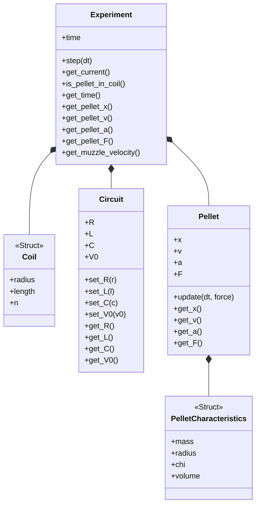
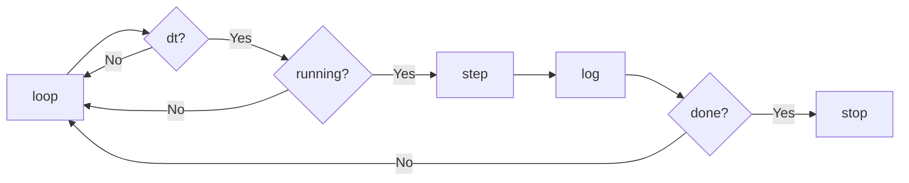

# Computation analysis of an electromagnetical propulsion system (a.k.a., coilgun!)

Experiment 1 corresponds to the graphs of acceleration, speed, distance, force, current and magnetic field.

Experiment 2 plots Distance vs Capacitance

Experiment 3 is a real-time simulation of the system.

## Running the experiments

1. Install Julia and the Plots Package
2. Start the Julia REPL (type julia in the console) and then run include("experiment1") or include("experiment2") or include("experiment3"). 
4. Enjoy your plots!

# Simulation Architecture for Embedded

I also made available a C++ version of the simulation to run it on embedded systems (mainly Arduino tbh, but simple modifications would allow one to use it on other kinds of controllers if they're based on C++). To run it, simply compile it on the Arduino IDE or in VSCode. If you are not interested in the code, the class diagram is as follows:

The Arduino setup() function sets values for the experiment and each of the subclasses/structs. The Arduino loop() function advances the simulation using a timestep.

At each iteration:
1. the program waits until the next timestep is reached,
2. advances the simulation,
3. logs key values,
4. and stops when the pellet exits the coil or the time limit is reached.

Feel free to use, modify, etc. :)

# Project Roadmap

- [x] *Build the experimental setup*  
  
  **What:** Assemble the physical coilgun prototype and supporting hardware.  
  **Why:** Building the apparatus early helps reveal practical constraints and implementation issues that are not obvious in the theoretical design.  
  **How:** Assemble the setup during class hours, 3D print the mechanical support structure after hours, wind and count the coil turns, and integrate the solenoid into the system.

- [ ] *Refine the theoretical model*
      
  **What:** Estimate realistic values for inductance, capacitance, and resistance.  
  **Why:** The simulation depends strongly on accurate electrical parameters, so reasonable first estimates are needed before experimental validation.  
  **How:** Use the resonance relation $\omega_0 = 1/\sqrt{LC}$ to estimate inductance, and test different capacitor and resistor values to match the expected system behavior.

- [ ] *Perform calibration and preliminary tests* 
  
  **What:** Verify that the electrical and mechanical subsystems behave as expected.  
  **Why:** Initial calibration is necessary to ensure that the measured behavior is reliable before collecting full experimental data.  
  **How:** Measure resistance and approximate inductance, confirm capacitor charging and discharge behavior, and test whether the pellet moves consistently under controlled conditions.

- [ ] *Acquire experimental data*  
  
  **What:** Collect measurements from repeated launches under controlled conditions.  
  **Why:** Experimental data is required to validate the simulation and evaluate real system performance.  
  **How:** Record pellet displacement, exit velocity, discharge timing, and any measurable current or voltage characteristics across multiple trials.

- [ ] *Compare experimental and simulated results*  
  
  **What:** Evaluate how closely the computational model matches the physical system.  
  **Why:** This comparison will show whether the model captures the dominant behavior of the launcher and where its assumptions break down.  
  **How:** Compare predicted and measured values such as current evolution, pellet position, acceleration, and muzzle velocity.

- [ ] *Finalize the report and presentation*  
  
  **What:** Consolidate the theoretical, computational, and experimental results.
  **Why:** The final report and presentation should clearly communicate the project’s objectives, methods, results, and conclusions.  
  **How:** Organize the results, prepare figures and diagrams, summarize findings, and assemble the final written report and presentation slides.

