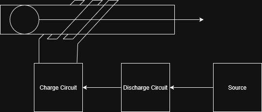
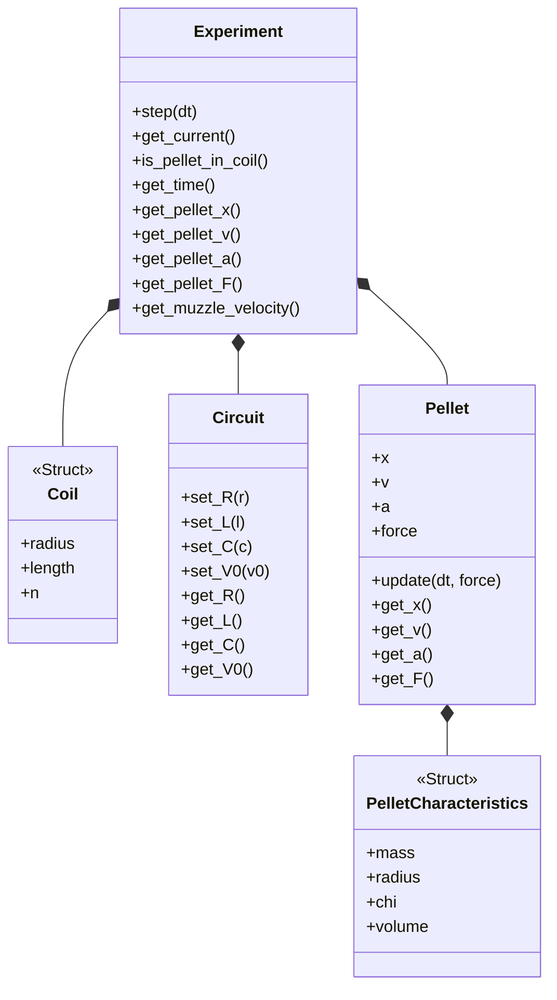

# Computation analysis of an electromagnetical propulsion system (a.k.a., coilgun!)



Experiment 1 corresponds to the graphs of acceleration, speed, distance, force, current and magnetic field.

Experiment 2 plots Distance vs Capacitance

Experiment 3 is a real-time simulation of the system.

## Running the experiments

1. Install Julia and the Plots Package
2. Start the Julia REPL (type julia in the console) and then run include("experiment1") or include("experiment2") or include("experiment3"). 
4. Enjoy your plots!

# Simulation Architecture for Embedded

I also made available a C++ version of the simulation to run it on embedded systems (mainly Arduino tbh, but simple modifications would allow one to use it on other kinds of controllers if they're based on C++). To run it, simply compile it on the Arduino IDE or in VSCode. If you are not interested in the code, the class diagram is as follows:



The loop() function advances the simulation using a timestep.

At each iteration:
1. the program waits until the next timestep is reached,
2. advances the simulation,
3. logs key values,
4. and stops when the pellet exits the coil or the time limit is reached.


```{mermaid}
flowchart LR
    A[loop()] --> B{dt?}
    B -- No --> A
    B -- Yes --> C{running?}
    C -- No --> A
    C -- Yes --> D[step]
    D --> E[log]
    E --> F{done?}
    F -- Yes --> G[stop]
    F -- No --> A
```

Feel free to use, modify, etc. :)
